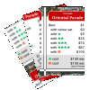
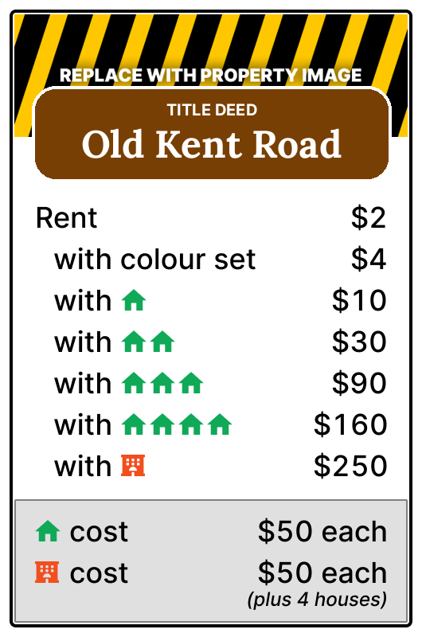
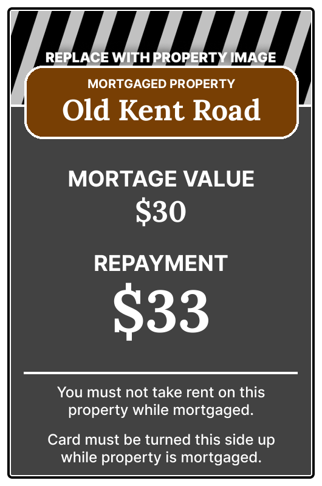
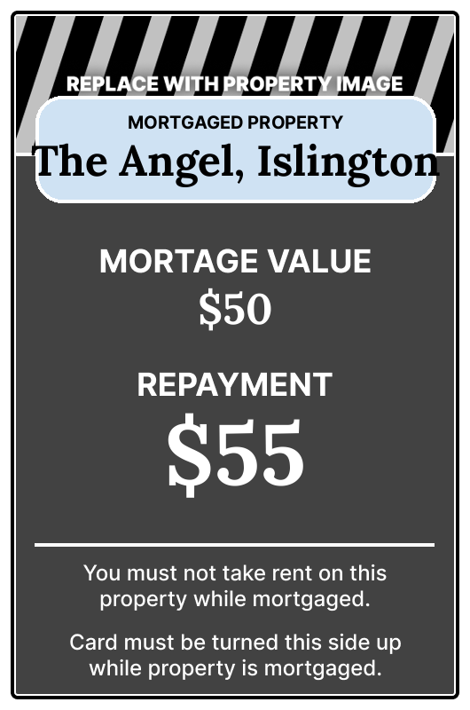
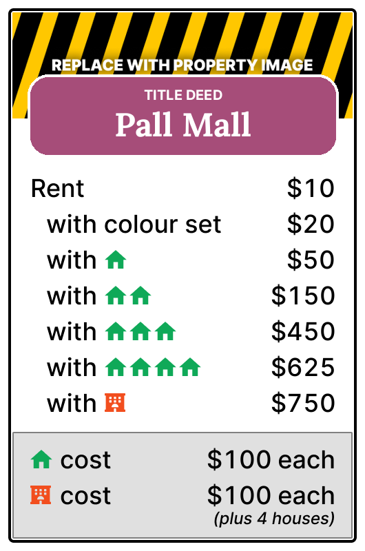
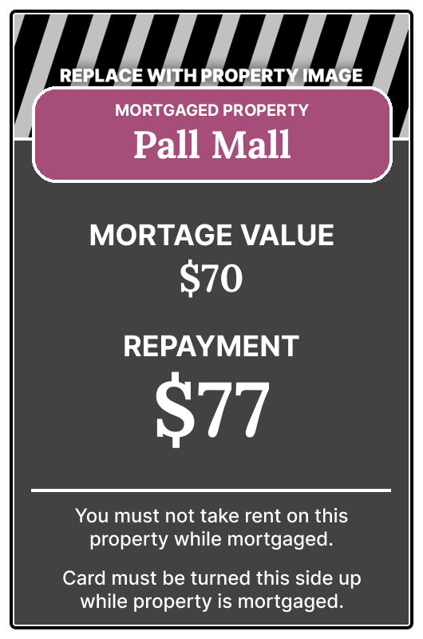
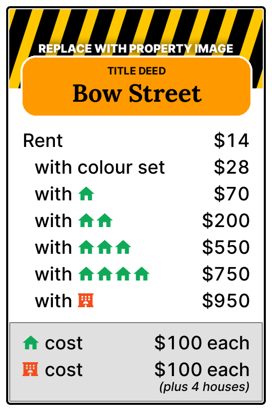
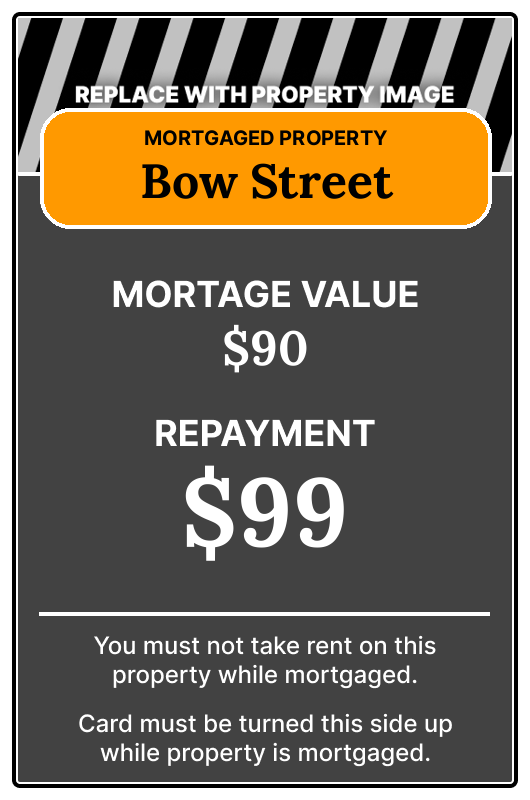

<p align="center"></p>
<h1 align="center">Property Card Generator</h1>

This is a script to batch generate property cards for customised Monopoly
games.

This has been a one-off project for me, but contributions are welcome to
improve the code and make it more accessible for others.

## Running

Clone the repo, create a virtual environment (if you'd like), install [Pillow],
and generate the cards.

```bash
# clone the repo
git clone https://github.com/itisrazza/monopoly-pcard-gen

# create a virtual environment (optional)
/path/to/python -m venv .venv
source ./.venv/bin/activate

# install Pillow
pip install Pillow

# generate the images
python generate.py
```

[Pillow]: https://pillow.readthedocs.io/

Properties are read in from [`properties.csv`](properties.csv), with images read in from the [`images`](images) folder, and the results will be dropped into the [`output`](output) folder.

You should now have property cards like these:

 
 
 
 

## Details

The template for the [front](front.png) and [back](back.png) are in the root folder, with the fonts.

### properties.csv

| Column                               |
|--------------------------------------|
| Property group (first of group only) |
| Property name                        |
| Rent                                 |
| Rent, with colour set                |
| Rent, with 1 house                   |
| Rent, with 2 houses                  |
| Rent, with 3 houses                  |
| Rent, with 4 houses                  |
| Rent, with hotel                     |
| House cost                           |
| Hotel cost                           |
| Mortgage value                       |
| Mortgage repayment                   |

Each property colour is given a letter in the order they are on the board starting from GO. A1 to H2.

## Licence

> [Monopoly Property Card Generator by Raresh Nistor](https://github.com/itisrazza/monopoly-pcard-gen) is marked with [CC0 1.0](https://creativecommons.org/publicdomain/zero/1.0?ref=chooser-v1)
>
> By marking the work with a CC0 public domain dedication, the creator is giving up their copyright and allowing reusers to distribute, remix, adapt, and build upon the material in any medium or format, even for commercial purposes.

Assets used in this work fall under their own licences and what not:

- [Inter](https://rsms.me/inter/) and [Lora](https://github.com/cyrealtype/Lora-Cyrillic) typefaces are licensed under [OFL 1.1](LICENCE.OFL).
- Property names in `properties.csv` may be trademark of Hasbro.
